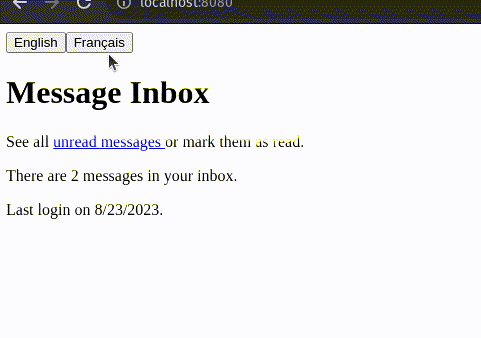

# Lingui + RSpack Example

This project shows how to use the [Rspack JavaScript bundler](https://www.rspack.dev/guide/introduction.html) with [Lingui JS](https://lingui.dev/) to provide i18n for a React application (TypeScript).

## Setup Instructions

1. `npm install` to install dependencies
2. `npm run dev` to run the development server.
3. `npm run build` to build the application.

## Update I18n

1. Wrap any messages requiring translation in `<Trans>` or a related macro.
2. `npm run extract` to generate message catalogs in `src/locales/{locale}/messages`.
3. Translate any new messages in the catalogs.
4. `npm run compile` to create runtime catalogs.

## Configuration File Notes

- [`rspack.config.js`](./rspack.config.js) specifies that the [`builtin:swc-loader`](https://www.rspack.dev/guide/builtin-swc-loader.html#builtinswc-loader) to transcompile all `.tsx` files using the Lingui SWC plugin. This is crucial for transcompiling Lingui Macros like `<Trans>` into their respective React components.
- [`lingui.config.ts`](./lingui.config.ts) specifies the available locales, defaults, and paths where the message catalogs are stored.

## Helpful Resources

- This [blog post](https://betterprogramming.pub/react-app-internationalization-with-linguijs-9486ccd80e07) shows a step-by-step guide to set up LinguiJS with React.
- [Official documentation for React setup with LinguiJS](https://lingui.dev/tutorials/react). This repo closely follows the example from the official docs.
